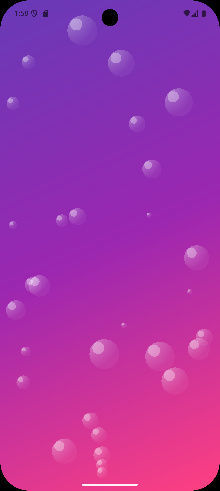
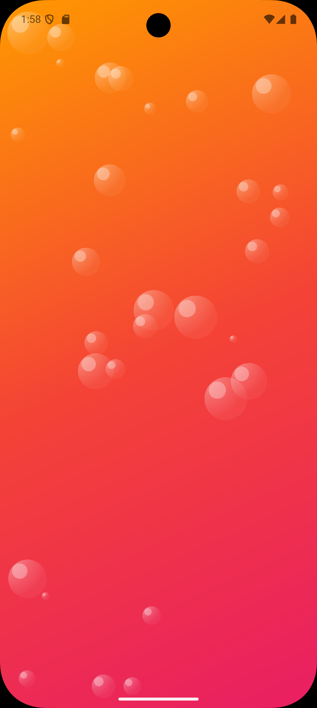
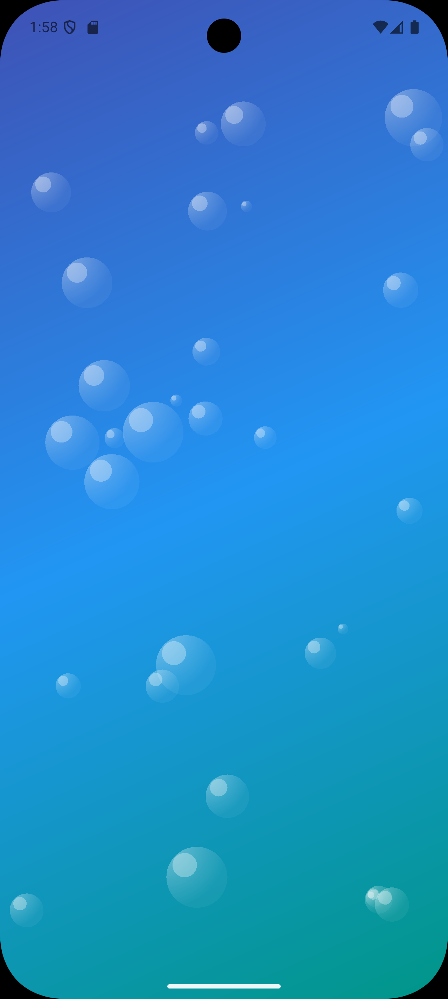
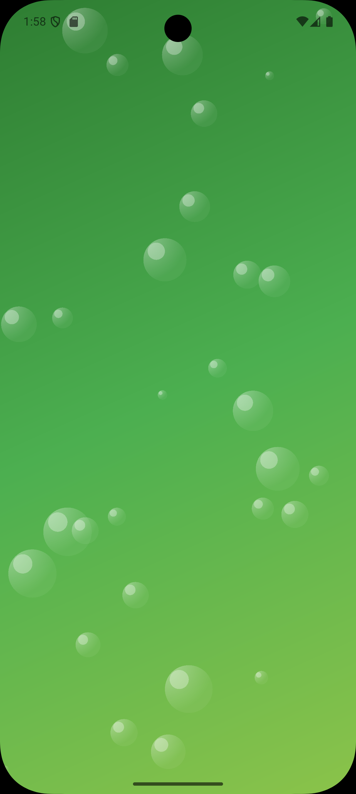
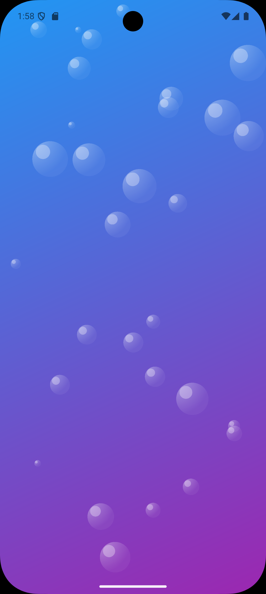

<div align="center">

# 🌊 Flutter Animated Bubble Background

[](https://pub.dev/packages/flutter_animated_bubble_background)
[](https://flutter.dev)
[](https://dart.dev)
[](LICENSE)

**Un paquete Flutter que crea fondos animados espectaculares con burbujas flotantes y degradados personalizables**

[🚀 Instalación](#-instalación) • [📱 Uso](#-uso-básico) • [🎨 Ejemplos](#-galería-visual) • [📖 API](#-api-completa) • [🔧 Ejemplo Completo](example/)

---

### 🎬 Demo en Vivo





*Burbujas que flotan, rebotan y brillan con física realista*

</div>

## ✨ Características

<table>
<tr>
<td>🎨</td>
<td><strong>Degradados Personalizables</strong><br/>Crea fondos únicos con gradientes de múltiples colores</td>
</tr>
<tr>
<td>🫧</td>
<td><strong>Burbujas Realistas</strong><br/>Burbujas que flotan con física natural y efectos de brillo</td>
</tr>
<tr>
<td>🏓</td>
<td><strong>Física de Rebote</strong><br/>Las burbujas rebotan naturalmente al tocar los bordes</td>
</tr>
<tr>
<td>⚙️</td>
<td><strong>Altamente Configurable</strong><br/>Controla cantidad, tamaño, velocidad y colores</td>
</tr>
<tr>
<td>📱</td>
<td><strong>Optimizado para Móviles</strong><br/>Rendimiento fluido en todas las plataformas</td>
</tr>
<tr>
<td>�</td>
<td><strong>Efectos Visuales</strong><br/>Brillos realistas y transparencias suaves</td>
</tr>
</table>

## 🚀 Instalación

### 📦 Desde pub.dev

```yaml
dependencies:
  flutter_animated_bubble_background: ^0.0.1
```

### 🔧 Comandos de instalación

```bash
# Instalar el paquete
flutter pub add flutter_animated_bubble_background

# O manualmente
flutter pub get
```

### 📱 Importar en tu proyecto

```dart
import 'package:flutter_animated_bubble_background/flutter_animated_bubble_background.dart';
```

## 💻 Uso Básico

### 🎯 Implementación Minimalista

```dart
import 'package:flutter/material.dart';
import 'package:flutter_animated_bubble_background/flutter_animated_bubble_background.dart';

class MiPantalla extends StatelessWidget {
  @override
  Widget build(BuildContext context) {
    return Scaffold(
      body: AnimatedBubbleBackground(
        // 🌈 Define tu gradiente personalizado
        gradientColors: [
          Colors.blue,
          Colors.purple,
          Colors.pink,
        ],
        child: Center(
          child: Text(
            '¡Hola Mundo! 👋',
            style: TextStyle(
              fontSize: 28,
              color: Colors.white,
              fontWeight: FontWeight.bold,
              shadows: [
                Shadow(
                  offset: Offset(0, 2),
                  blurRadius: 4,
                  color: Colors.black26,
                ),
              ],
            ),
          ),
        ),
      ),
    );
  }
}
```

### 🔥 Configuración Avanzada

```dart
AnimatedBubbleBackground(
  // 🎨 Gradiente personalizado
  gradientColors: [
    Colors.deepPurple,
    Colors.indigo,
    Colors.blue,
    Colors.teal,
  ],
  
  // 🫧 Configuración de burbujas
  bubbleCount: 30,           // Cantidad de burbujas
  minBubbleSize: 15.0,       // Tamaño mínimo
  maxBubbleSize: 50.0,       // Tamaño máximo
  
  // ⚡ Animación y física
  speed: 1.5,                // Velocidad de movimiento
  
  // 🎭 Estilo visual
  bubbleColor: Colors.white,     // Color base
  bubbleOpacity: 180,            // Transparencia (0-255)
  minCircleBubbleColor: Colors.lightBlueAccent,
  
  child: TuContenidoAqui(),
)
```

## 🎨 Galería Visual

<div align="center">

### 🌟 Ejemplo de temas

<table>
<tr>
<td align="center">

<br/>
<strong>🌌 Galaxia Violeta</strong>
<br/>
<code>Entertainment • Gaming</code>
</td>
<td align="center">

<br/>
<strong>🌅 Atardecer Tropical</strong>
<br/>
<code>Travel • Photography</code>
</td>
<td align="center">

<br/>
<strong>🌊 Océano Profundo</strong>
<br/>
<code>Health • Meditation</code>
</td>
</tr>
<tr>
<td align="center">

<br/>
<strong>🌲 Bosque Místico</strong>
<br/>
<code>Nature • Eco-Friendly</code>
</td>
<td align="center">

<br/>
<strong>💙 Elegante Básico</strong>
<br/>
<code>Corporate • Business</code>
</td>
<td align="center">

<br/>
<strong>✨ Tu Diseño</strong>
<br/>
<code>¡Personalízalo!</code>
</td>
</tr>
</table>

</div>

## 📖 API Completa

### 🔧 Parámetros de Configuración

<table>
<thead>
<tr>
<th>Parámetro</th>
<th>Tipo</th>
<th>Default</th>
<th>Descripción</th>
<th>Rango</th>
</tr>
</thead>
<tbody>
<tr>
<td><code>gradientColors</code></td>
<td><code>List&lt;Color&gt;</code></td>
<td><strong>Requerido</strong></td>
<td>Colores del degradado de fondo</td>
<td>2-5 colores</td>
</tr>
<tr>
<td><code>bubbleCount</code></td>
<td><code>int</code></td>
<td><code>20</code></td>
<td>Número total de burbujas</td>
<td>10-50</td>
</tr>
<tr>
<td><code>minBubbleSize</code></td>
<td><code>double</code></td>
<td><code>10.0</code></td>
<td>Tamaño mínimo de burbujas</td>
<td>5.0-30.0</td>
</tr>
<tr>
<td><code>maxBubbleSize</code></td>
<td><code>double</code></td>
<td><code>40.0</code></td>
<td>Tamaño máximo de burbujas</td>
<td>20.0-100.0</td>
</tr>
<tr>
<td><code>speed</code></td>
<td><code>double</code></td>
<td><code>1.0</code></td>
<td>Velocidad de animación</td>
<td>0.1-3.0</td>
</tr>
<tr>
<td><code>bubbleColor</code></td>
<td><code>Color</code></td>
<td><code>Colors.white</code></td>
<td>Color base de las burbujas</td>
<td>Cualquier Color</td>
</tr>
<tr>
<td><code>bubbleOpacity</code></td>
<td><code>int</code></td>
<td><code>76</code></td>
<td>Transparencia (0-255)</td>
<td>50-200</td>
</tr>
<tr>
<td><code>minCircleBubbleColor</code></td>
<td><code>Color</code></td>
<td><code>Colors.white</code></td>
<td>Color de burbujas pequeñas</td>
<td>Cualquier Color</td>
</tr>
<tr>
<td><code>child</code></td>
<td><code>Widget?</code></td>
<td><code>null</code></td>
<td>Contenido sobre el fondo</td>
<td>-</td>
</tr>
</tbody>
</table>

## 🚀 Casos de Uso

<details>
<summary>📱 <strong>Pantalla de Bienvenida</strong></summary>

```dart
AnimatedBubbleBackground(
  gradientColors: [Colors.orange, Colors.red, Colors.pink],
  bubbleCount: 25,
  speed: 1.2,
  child: Column(
    mainAxisAlignment: MainAxisAlignment.center,
    children: [
      Icon(Icons.star, size: 100, color: Colors.white),
      SizedBox(height: 20),
      Text(
        'Bienvenido a MiApp',
        style: TextStyle(fontSize: 30, color: Colors.white, fontWeight: FontWeight.bold),
      ),
      SizedBox(height: 10),
      Text(
        'Descubre algo increíble',
        style: TextStyle(fontSize: 16, color: Colors.white70),
      ),
    ],
  ),
)
```

</details>

<details>
<summary>⏳ <strong>Pantalla de Carga</strong></summary>

```dart
AnimatedBubbleBackground(
  gradientColors: [Colors.green, Colors.lightGreen, Colors.teal],
  bubbleCount: 15,
  speed: 0.8,
  bubbleOpacity: 100,
  child: Center(
    child: Column(
      mainAxisAlignment: MainAxisAlignment.center,
      children: [
        CircularProgressIndicator(
          color: Colors.white,
          strokeWidth: 3,
        ),
        SizedBox(height: 20),
        Text(
          'Cargando...',
          style: TextStyle(color: Colors.white, fontSize: 18),
        ),
      ],
    ),
  ),
)
```

</details>

<details>
<summary>🎮 <strong>Fondo de Gaming</strong></summary>

```dart
AnimatedBubbleBackground(
  gradientColors: [
    Colors.deepPurple,
    Colors.purple,
    Colors.pinkAccent,
    Colors.cyan,
  ],
  bubbleCount: 40,
  speed: 2.0,
  minBubbleSize: 8.0,
  maxBubbleSize: 60.0,
  bubbleOpacity: 150,
  child: GameContent(),
)
```

</details>

<details>
<summary>🧘 <strong>App de Meditación</strong></summary>

```dart
AnimatedBubbleBackground(
  gradientColors: [
    Colors.indigo,
    Colors.blue.shade300,
    Colors.lightBlue.shade200,
  ],
  bubbleCount: 12,
  speed: 0.4,
  minBubbleSize: 20.0,
  maxBubbleSize: 45.0,
  bubbleOpacity: 80,
  child: MeditationUI(),
)
```

</details>

## 📱 Plataformas Soportadas

<div align="center">

| Plataforma | Estado | Versión Mínima |
|------------|--------|----------------|
| **📱 Android** | ✅ Completo | API 16+ |
| **🍎 iOS** | ✅ Completo | iOS 9.0+ |
| **🌐 Web** | ✅ Completo | Cualquiera |
| **🖥️ Windows** | ✅ Completo | Windows 10+ |
| **🍎 macOS** | ✅ Completo | macOS 10.14+ |
| **🐧 Linux** | ✅ Completo | Cualquiera |

</div>

## 🔧 Ejemplo Completo

¿Quieres ver el widget en acción? Revisa nuestro [**ejemplo completo**](example/) que incluye:

- 🎨 **5 temas predefinidos** con diferentes configuraciones
- 🎮 **Interfaz interactiva** para cambiar parámetros en tiempo real
- 📊 **Métricas de rendimiento** para optimizar tu implementación
- 💡 **Mejores prácticas** y casos de uso recomendados

```bash
# Ejecutar el ejemplo
cd example
flutter run
```

## 🤝 Contribuir

¡Las contribuciones son bienvenidas! 🎉

### 🌟 Cómo contribuir

1. 🍴 **Fork** el repositorio
2. 🌿 **Crea** una rama para tu feature: `git checkout -b feature/nueva-funcionalidad`
3. 💾 **Commit** tus cambios: `git commit -m 'Añadir nueva funcionalidad'`
4. 📤 **Push** a la rama: `git push origin feature/nueva-funcionalidad`
5. 🎯 **Abre** un Pull Request

### 🐛 Reportar Bugs

Si encuentras un bug, por favor [abre un issue](https://github.com/GianSandoval5/flutter_animated_bubble_background/issues) con:

- 📱 Plataforma y versión de Flutter
- 🔍 Descripción detallada del problema
- 📋 Pasos para reproducir
- 📸 Capturas de pantalla (si es aplicable)

## 📄 Licencia

Este proyecto está bajo la [**Licencia MIT**](LICENSE) - consulta el archivo LICENSE para más detalles.

```
MIT License - Copyright (c) 2025 Gian Sandoval
```

---

<div align="center">

### ⭐ ¿Te gustó el paquete?

Si **Flutter Animated Bubble Background** te fue útil, considera:

- ⭐ **Darle una estrella** al repositorio
- 🐦 **Compartirlo** en redes sociales
- 📝 **Escribir una reseña** en pub.dev
- 🤝 **Contribuir** al proyecto

**Hecho con ❤️ para la comunidad Flutter**

[🔝 Volver arriba](#-flutter-animated-bubble-background)

</div>
