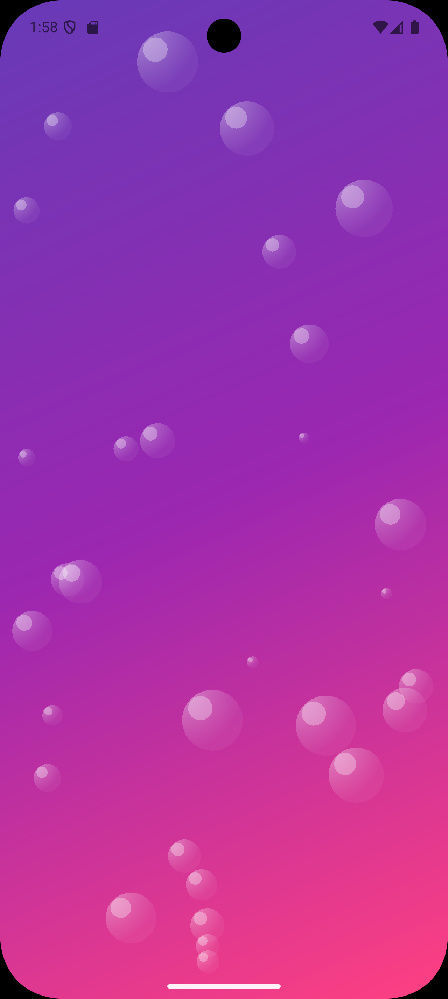
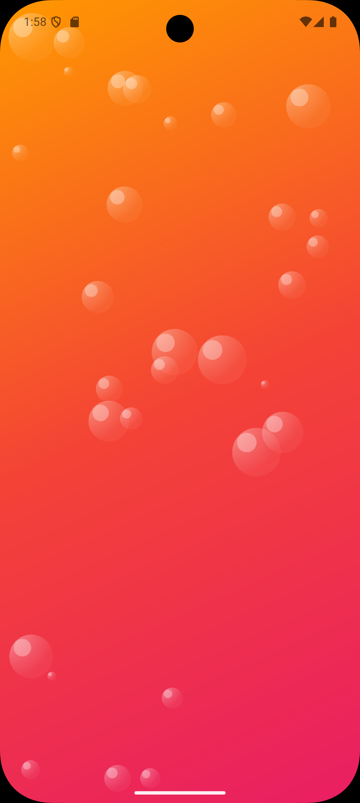
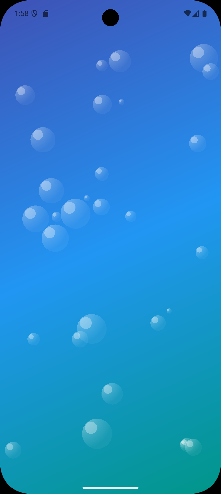
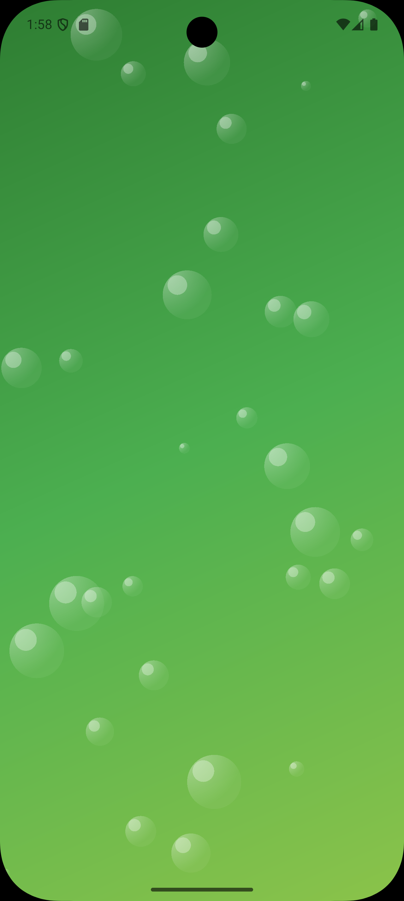
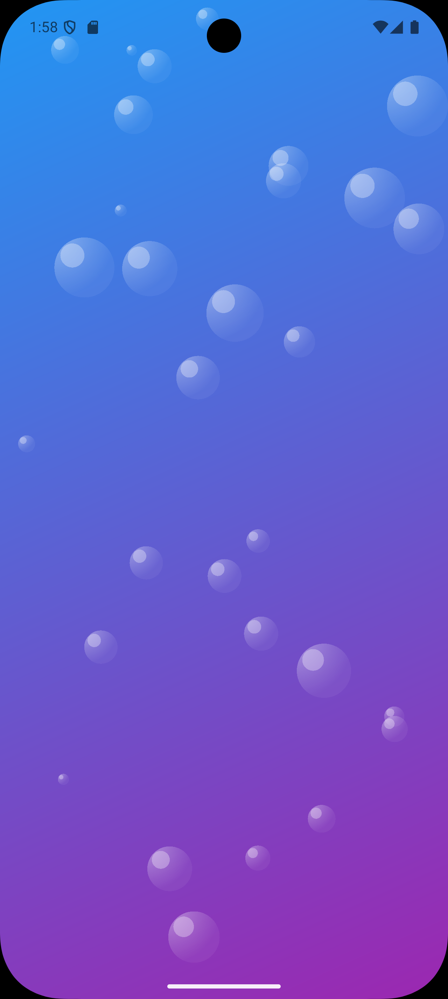

<div align="center">

# 🌊 Flutter Animated Bubble Background - Example

[](https://flutter.dev)
[](https://dart.dev)
[](../LICENSE)

*Un ejemplo completo y profesional que demuestra el poder del widget AnimatedBubbleBackground*

[📱 Ver Demo](#-demo-visual) • [🚀 Instalación](#-instalación) • [🎨 Personalización](#-personalización) • [📖 Documentación](#-documentación)

</div>

---

## 🎬 Demo Visual

<div align="center">

### 🌌 Configuración Actual: Galaxia Violeta



*Gradiente dinámico con 30 burbujas animadas en tonos violeta y rosa*

</div>

## ✨ Características

<table>
<tr>
<td>🎨</td>
<td><strong>Gradientes Personalizables</strong><br/>Crea fondos únicos con gradientes de múltiples colores</td>
</tr>
<tr>
<td>💫</td>
<td><strong>Animaciones Fluidas</strong><br/>Burbujas que se mueven suavemente con física realista</td>
</tr>
<tr>
<td>🎮</td>
<td><strong>Interfaz Minimalista</strong><br/>Diseño limpio que no interfiere con tu contenido</td>
</tr>
<tr>
<td>🔧</td>
<td><strong>Altamente Configurable</strong><br/>Más de 7 parámetros para personalizar completamente</td>
</tr>
<tr>
<td>⚡</td>
<td><strong>Rendimiento Optimizado</strong><br/>Animaciones eficientes que no afectan el rendimiento</td>
</tr>
<tr>
<td>📱</td>
<td><strong>Responsive</strong><br/>Se adapta perfectamente a cualquier tamaño de pantalla</td>
</tr>
</table>

## 🎭 Configuración Actual

> **Tema: Galaxia Violeta** ✨
>
> ```yaml
> Gradiente: Morado Profundo → Morado → Rosa Vibrante
> Burbujas: 30 elementos animados
> Tamaños: 10px - 60px
> Velocidad: 1.5x (50% más rápido)
> Opacidad: 180/255 (70% transparente)
> ```r Animated Bubble Background

Este es un ejemplo de uso del paquete `flutter_animated_bubble_background` que demuestra cómo crear fondos animados con burbujas personalizables.

## Características del ejemplo

- 🎨 Colores de gradiente completamente personalizables
- � Burbujas animadas con propiedades configurables
- 🎮 Interfaz limpia y minimalista
- 🔧 Fácil personalización de todos los parámetros

## Configuración actual

El ejemplo actual utiliza la configuración **Galaxia Violeta** con:
- Gradiente: Morado profundo → Morado → Rosa vibrante
- 30 burbujas blancas
- Tamaños de 10 a 60 píxeles
- Velocidad de animación: 1.5x

## 🚀 Instalación

### Prerrequisitos

- Flutter SDK 3.0+
- Dart SDK 3.0+

### Pasos de instalación

```bash
# 1. Clona el repositorio
git clone https://github.com/GianSandoval5/flutter_animated_bubble_background.git

# 2. Navega al directorio del ejemplo
cd flutter_animated_bubble_background/example

# 3. Instala las dependencias
flutter pub get

# 4. Ejecuta la aplicación
flutter run
```

### Ejecución en diferentes plataformas

```bash
# Android
flutter run -d android

# iOS
flutter run -d ios

# Web
flutter run -d chrome

# Windows
flutter run -d windows

# macOS
flutter run -d macos
```

## 💻 Código de Ejemplo

### Implementación Principal

<details>
<summary>📂 <strong>home_example.dart</strong> - Click para expandir</summary>

```dart
import 'package:example/src/utils/app_colors.dart';
import 'package:flutter/material.dart';
import 'package:flutter_animated_bubble_background/flutter_animated_bubble_background.dart';

class HomeExample extends StatefulWidget {
  const HomeExample({super.key});

  @override
  State<HomeExample> createState() => _HomeExampleState();
}

class _HomeExampleState extends State<HomeExample> {
  @override
  Widget build(BuildContext context) {
    return Scaffold(
      body: AnimatedBubbleBackground(
        // 🎨 Gradiente personalizado
        gradientColors: AppColors.purpleGalaxyGradient,
        
        // 🔢 Configuración de burbujas
        bubbleCount: 30,
        minBubbleSize: 10.0,
        maxBubbleSize: 60.0,
        
        // ⚡ Velocidad y animación
        speed: 1.5,
        
        // 🎭 Colores y transparencia
        bubbleColor: Colors.white,
        bubbleOpacity: 180,
        minCircleBubbleColor: Colors.white,
        
        // 📱 Contenido de la aplicación
        child: SafeArea(
          child: Column(
            children: [
              // 🔥 Aquí va tu contenido increíble
              const Center(
                child: Text(
                  '¡Bienvenido!',
                  style: TextStyle(
                    fontSize: 32,
                    fontWeight: FontWeight.bold,
                    color: Colors.white,
                  ),
                ),
              ),
            ],
          ),
        ),
      ),
    );
  }
}
```

</details>

### Estructura del Proyecto

```
example/
├── lib/
│   ├── main.dart                 # 🚀 Punto de entrada
│   └── src/
│       ├── pages/
│       │   └── home_example.dart # 📱 Página principal
│       └── utils/
│           └── app_colors.dart   # 🎨 Paleta de colores
└── pubspec.yaml                  # 📦 Dependencias
```

## 🎨 Personalización

### 🌈 Galería de Temas Predefinidos

<div align="center">

| 🎨 Tema | 📸 Preview | 🎯 Casos de Uso |
|---------|------------|------------------|
| **🌌 Galaxia Violeta** |  | Apps de entretenimiento, música, gaming |
| **🌅 Atardecer Tropical** |  | Apps de viajes, fotografía, lifestyle |
| **🌊 Océano Profundo** |  | Apps de salud, meditación, wellness |
| **🌲 Bosque Místico** |  | Apps de naturaleza, eco-friendly, outdoors |
| **💙 Básico Elegante** |  | Apps corporativas, productividad, business |

</div>

<details>
<summary>🎭 <strong>Ver configuraciones técnicas de cada tema</strong></summary>

```dart
// 🌌 Galaxia Violeta (Actual)
static const List<Color> purpleGalaxyGradient = [
  Colors.deepPurple,    // #673AB7
  Colors.purple,        // #9C27B0  
  Colors.pinkAccent,    // #FF4081
];

// 🌅 Atardecer Tropical
static const List<Color> tropicalSunsetGradient = [
  Colors.orange,        // #FF9800
  Colors.red,          // #F44336
  Colors.pink,         // #E91E63
];

// 🌊 Océano Profundo  
static const List<Color> deepOceanGradient = [
  Colors.indigo,        // #3F51B5
  Colors.blue,         // #2196F3
  Colors.teal,         // #009688
];

// 🌲 Bosque Místico
static List<Color> mysticalForestGradient = [
  Colors.green.shade800, // #2E7D32
  Colors.green,         // #4CAF50
  Colors.lightGreen,    // #8BC34A
];

// 💙 Básico Elegante
static const List<Color> basicExampleGradient = [
  Colors.blue,          // #2196F3
  Colors.purple,        // #9C27B0
];
```

</details>

### 🛠️ Creando Tus Propios Colores

#### app_colors.dart - Tu Paleta Personal

```dart
class AppColors {
  // ✨ Tema actual - Galaxia Violeta
  static const List<Color> purpleGalaxyGradient = [
    Colors.deepPurple,    // #673AB7
    Colors.purple,        // #9C27B0
    Colors.pinkAccent,    // #FF4081
  ];

  // 🌅 Más opciones predefinidas
  static const List<Color> tropicalSunsetGradient = [
    Colors.orange,        // #FF9800
    Colors.red,          // #F44336
    Colors.pink,         // #E91E63
  ];

  // 🎨 ¡Crea el tuyo!
  static const List<Color> miTemaPersonalizado = [
    Color(0xFF6A0DAD),   // Púrpura Real
    Color(0xFF9370DB),   // Violeta Medio
    Color(0xFFDDA0DD),   // Ciruela
  ];

  // 🌙 Tema Nocturno
  static const List<Color> midnightDream = [
    Color(0xFF0f0f23),   // Azul Muy Oscuro
    Color(0xFF1a1a2e),   // Púrpura Oscuro
    Color(0xFF16213e),   // Azul Medianoche
  ];

  // 🔥 Tema Fuego
  static const List<Color> fireStorm = [
    Color(0xFF8B0000),   // Rojo Oscuro
    Color(0xFFFF4500),   // Naranja Rojo
    Color(0xFFFFD700),   // Dorado
  ];
}
```

### ⚙️ Parámetros de Configuración

<table>
<thead>
<tr>
<th>Parámetro</th>
<th>Tipo</th>
<th>Descripción</th>
<th>Rango Recomendado</th>
<th>Ejemplo</th>
</tr>
</thead>
<tbody>
<tr>
<td><code>gradientColors</code></td>
<td><code>List&lt;Color&gt;</code></td>
<td>Lista de colores para el degradado</td>
<td>2-5 colores</td>
<td><code>[Colors.blue, Colors.purple]</code></td>
</tr>
<tr>
<td><code>bubbleCount</code></td>
<td><code>int</code></td>
<td>Número total de burbujas</td>
<td>15-50</td>
<td><code>30</code></td>
</tr>
<tr>
<td><code>minBubbleSize</code></td>
<td><code>double</code></td>
<td>Tamaño mínimo en píxeles</td>
<td>5.0-20.0</td>
<td><code>10.0</code></td>
</tr>
<tr>
<td><code>maxBubbleSize</code></td>
<td><code>double</code></td>
<td>Tamaño máximo en píxeles</td>
<td>40.0-100.0</td>
<td><code>60.0</code></td>
</tr>
<tr>
<td><code>speed</code></td>
<td><code>double</code></td>
<td>Velocidad de animación</td>
<td>0.5-3.0</td>
<td><code>1.5</code></td>
</tr>
<tr>
<td><code>bubbleColor</code></td>
<td><code>Color</code></td>
<td>Color principal de burbujas</td>
<td>-</td>
<td><code>Colors.white</code></td>
</tr>
<tr>
<td><code>bubbleOpacity</code></td>
<td><code>int</code></td>
<td>Transparencia (0-255)</td>
<td>100-200</td>
<td><code>180</code></td>
</tr>
<tr>
<td><code>minCircleBubbleColor</code></td>
<td><code>Color</code></td>
<td>Color de burbujas pequeñas</td>
<td>-</td>
<td><code>Colors.white</code></td>
</tr>
</tbody>
</table>

### 🚀 Ejemplos de Configuraciones Avanzadas

<div align="center">

### 🎨 Galería de Configuraciones

<table>
<tr>
<td align="center">

<br/>
<strong>🌊 Océano Tranquilo</strong>
<br/>
<code>speed: 0.6 | burbujas: 20</code>
</td>
<td align="center">

<br/>
<strong>🔥 Energía Extrema</strong>
<br/>
<code>speed: 2.2 | burbujas: 45</code>
</td>
</tr>
<tr>
<td align="center">

<br/>
<strong>🌙 Modo Nocturno</strong>
<br/>
<code>speed: 0.8 | burbujas: 25</code>
</td>
<td align="center">

<br/>
<strong>✨ Galaxia Actual</strong>
<br/>
<code>speed: 1.5 | burbujas: 30</code>
</td>
</tr>
</table>

</div>

<details>
<summary>🌊 <strong>Configuración Océano Tranquilo</strong></summary>

```dart
AnimatedBubbleBackground(
  gradientColors: [
    Color(0xFF1e3c72), // Azul Profundo
    Color(0xFF2a5298), // Azul Océano
    Color(0xFF6dd5ed), // Cian Claro
  ],
  bubbleCount: 20,           // Pocas burbujas para tranquilidad
  minBubbleSize: 8.0,
  maxBubbleSize: 45.0,
  speed: 0.6,                // Movimiento lento y relajante
  bubbleColor: Colors.white.withOpacity(0.4),
  bubbleOpacity: 120,        // Muy transparente
  minCircleBubbleColor: Colors.lightBlueAccent,
  child: // Tu contenido
)
```

</details>

<details>
<summary>🔥 <strong>Configuración Energía Extrema</strong></summary>

```dart
AnimatedBubbleBackground(
  gradientColors: [
    Color(0xFFFF6B6B), // Rojo Coral
    Color(0xFFFFE66D), // Amarillo Vibrante
    Color(0xFF4ECDC4), // Turquesa
  ],
  bubbleCount: 45,           // Muchas burbujas para dinamismo
  minBubbleSize: 15.0,
  maxBubbleSize: 85.0,
  speed: 2.2,                // Movimiento rápido y energético
  bubbleColor: Colors.white,
  bubbleOpacity: 200,        // Más opaco para mayor impacto
  minCircleBubbleColor: Colors.orangeAccent,
  child: // Tu contenido
)
```

</details>

<details>
<summary>🌙 <strong>Configuración Modo Nocturno</strong></summary>

```dart
AnimatedBubbleBackground(
  gradientColors: [
    Color(0xFF0f0f23), // Azul Muy Oscuro
    Color(0xFF1a1a2e), // Púrpura Profundo
    Color(0xFF16213e), // Azul Medianoche
  ],
  bubbleCount: 25,
  minBubbleSize: 12.0,
  maxBubbleSize: 50.0,
  speed: 0.8,                // Movimiento suave nocturno
  bubbleColor: Colors.white.withOpacity(0.3),
  bubbleOpacity: 100,        // Muy sutil para no molestar
  minCircleBubbleColor: Colors.blueGrey.shade200,
  child: // Tu contenido
)
```

</details>

## 📚 Documentación

### 📱 Compatibilidad de Plataformas

<div align="center">

| Plataforma | Estado | Preview |
|------------|--------|---------|
| **📱 Android** | ✅ Totalmente Compatible |  |
| **🍎 iOS** | ✅ Totalmente Compatible |  |
| **🌐 Web** | ✅ Totalmente Compatible |  |
| **🖥️ Desktop** | ✅ Windows, macOS, Linux |  |

</div>

### 🔧 Mejores Prácticas

#### ✅ Recomendaciones

- **Rendimiento**: Mantén `bubbleCount` entre 15-35 para un rendimiento óptimo
- **Accesibilidad**: Usa `bubbleOpacity` ≤ 150 para no interferir con el contenido
- **UX**: Velocidades entre 0.8-1.5 son las más agradables para el usuario
- **Diseño**: Usa máximo 3-4 colores en `gradientColors` para evitar saturación

#### ❌ Evita Estos Errores

- No uses más de 50 burbujas en dispositivos de gama baja
- Evita colores muy similares en el gradiente
- No hagas burbujas demasiado grandes (>100px) en pantallas pequeñas
- No uses velocidades >3.0 ya que pueden marear al usuario

### 🎯 Casos de Uso Comunes

| Tipo de App | Configuración Recomendada | Ejemplo |
|-------------|---------------------------|---------|
| **App de Meditación** | Colores fríos, pocas burbujas, velocidad lenta | Azul + Verde, 15 burbujas, speed: 0.5 |
| **App de Gaming** | Colores vibrantes, muchas burbujas, velocidad alta | Rojo + Naranja, 40 burbujas, speed: 2.0 |
| **App Corporativa** | Colores sobrios, burbujas medianas, velocidad normal | Azul + Gris, 25 burbujas, speed: 1.0 |
| **App de Música** | Colores llamativos, burbujas dinámicas | Púrpura + Rosa, 35 burbujas, speed: 1.5 |

### 🤝 Contribuir

¿Tienes ideas para mejorar? ¡Nos encantaría escucharte!

1. 🍴 Fork el repositorio
2. 🌟 Crea tu feature branch: `git checkout -b feature/mi-nueva-funcionalidad`
3. 💾 Commit tus cambios: `git commit -m 'Añadir nueva funcionalidad'`
4. 📤 Push a la branch: `git push origin feature/mi-nueva-funcionalidad`
5. 🎯 Abre un Pull Request

---

<div align="center">

### ⭐ ¿Te gustó el proyecto?


Si este ejemplo te fue útil, considera darle una ⭐ al repositorio

**Hecho con ❤️ por la comunidad Flutter**

### 🌈 Explora Todos los Temas

<p>


</p>

[🔙 Volver arriba](#-flutter-animated-bubble-background---example)

</div>
